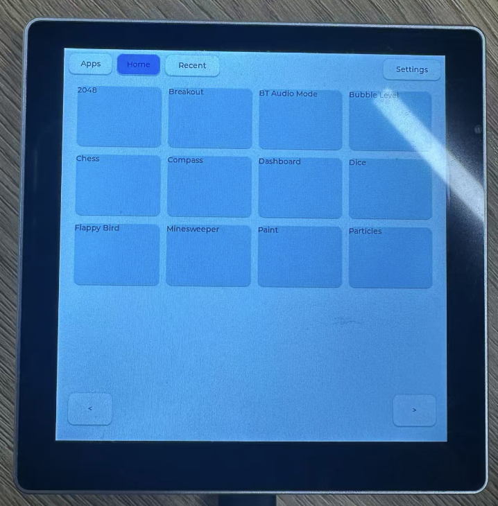
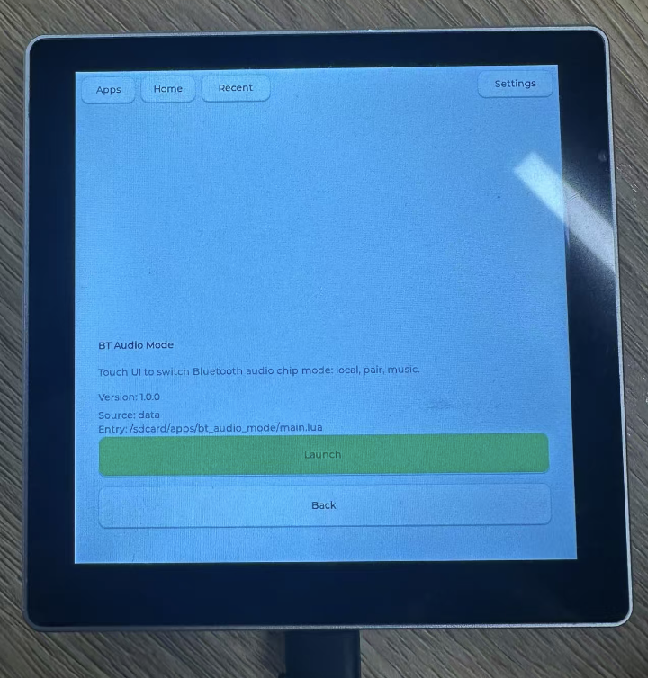
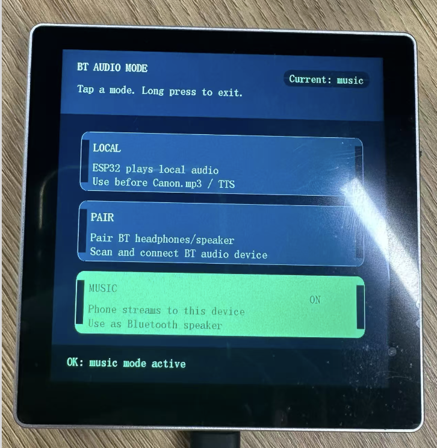

# ESP AI OS

[中文版本](./README_CN.md)

**ESP AI OS** is an embedded operating system layer built on Espressif chips, transforming the ESP-Claw AI agent framework into a complete application platform. It provides a touch-driven app launcher, display server, app lifecycle management, and a hardware abstraction layer — turning a bare-metal IoT device into a palm-sized AI computer.

The flagship platform is **ESP32-P4** (dual-core RISC-V, 720×720 MIPI-DSI, 32 MB PSRAM), with support for ESP32-S3, ESP32-C5, and ESP32-S31.

---

## Vision

> **Turn Espressif chips into AI-native application platforms.**

ESP AI OS sits between the ESP-Claw AI agent runtime and the hardware, providing the missing layer that turns a collection of Lua scripts into a cohesive user experience:

```
┌─────────────────────────────────────────────────────────────────┐
│                        Applications                             │
│   Games │ Sensors │ Camera │ Level │ Weather │ User Apps        │
├─────────────────────────────────────────────────────────────────┤
│                     ESP AI OS                                    │
│   Launcher │ Display Server │ App Lifecycle │ Hardware Abst.    │
├─────────────────────────────────────────────────────────────────┤
│                     ESP-Claw AI Runtime                          │
│   Agent Core │ Event Router │ Memory │ Skills │ Capabilities    │
├─────────────────────────────────────────────────────────────────┤
│                     ESP-IDF + Hardware                           │
│   ESP32-P4 │ MIPI-DSI │ PSRAM │ Flash │ Touch │ Sensors         │
└─────────────────────────────────────────────────────────────────┘
```

---

## The OS Layer

| OS Component   | Android Equivalent | ESP AI OS Implementation                                          |
| -------------- | ------------------ | ----------------------------------------------------------------- |
| Home Screen    | Launcher           | `launcher.lua` — desktop grid, app drawer, recent apps         |
| Display Server | SurfaceFlinger     | `display_arbiter` — exclusive display ownership per app        |
| Window Manager | WindowManager      | `lua_lvgl_runtime` — LVGL 9 renderer with DSI double-buffering |
| App Lifecycle  | ActivityManager    | `boot_launcher.c` — auto-launch, auto-restart, swipe-to-kill   |
| App Package    | APK                | Lua script +`manifest.json` with schema validation              |
| Hardware Bus   | HIDL/HAL           | `board_manager` — unified peripheral discovery and access      |
| Display Driver | DRM/KMS            | `esp_lcd_panel` (DSI/SPI/RGB) + per-panel vendor drivers        |
| Input          | InputFlinger       | LVGL indev + touch gesture detector (swipe up = kill app)         |
| Filesystem     | VFS                | `/system` (read-only firmware) + `/sdcard` (writable data)    |

---

## App Lifecycle

Each app is a Lua script with a `manifest.json`. Only one app runs at a time — the foreground-exclusive model guarantees deterministic hardware access on embedded devices.

```
User taps Launch
      │
      ▼
  launcher deinits LVGL, releases display
      │
      ▼
  thread.start(app) → app owns display + peripherals
      │
      ▼
  launcher exits completely (zero resource footprint)
      │
      ▼
  app runs until exit or swipe-up-to-kill
      │
      ▼
  boot_launcher detects no running scripts → auto-restarts launcher
```

---

## Key Features

- **Touch-Driven App Platform** — 4×3 desktop grid with pagination, scrollable drawer, app detail view, recent history
- **Full-Screen DSI Rendering** — `LV_DISPLAY_RENDER_MODE_FULL` double-buffering, 1 flush per frame, ~2 MB PSRAM, zero tearing on 720×720 panels
- **AI Agent Runtime** — Chat Coding via IM channels, event-driven agent loop, structured memory, MCP client/server
- **Clean Light Theme** — Modern UI with white cards, blue accents, optimized for 3.95" square displays
- **Hardware Abstraction** — Board Manager auto-discovers peripherals; apps use `board_manager.get_display_lcd_params()` without hard-coded pin numbers
- **Over-the-Air Development** — Push updated `launcher.lua` or app scripts to `/sdcard` without re-flashing firmware

---

## Performance (ESP32-P4 + MIPI-DSI)

| Metric             | Value                                                             |
| ------------------ | ----------------------------------------------------------------- |
| Display resolution | 720 × 720, 24 bpp                                                |
| LVGL render mode   | `FULL` (double-buffered)                                        |
| Display buffers    | 2 × 720 × 720 × 2 =**2 MB PSRAM**                        |
| Flushes per frame  | **1**                                                       |
| DMA pipeline       | Render buf1 while DSI transfers buf2                              |
| Panel wake-up      | `DISPON (0x29)` only on re-init; never sends `DISPOFF (0x28)` |
| Backlight          | Board-native LEDC PWM (not DCS commands)                          |

---

## Quick Start

```bash
# Install ESP-IDF v5.5.4
git clone -b v5.5.4 --recursive https://github.com/espressif/esp-idf.git
cd esp-idf && ./install.sh esp32p4 && . ./export.sh

# Build for Metalio Claw4 (ESP32-P4 + MIPI-DSI)
cd application/edge_agent
idf.py bmgr -c ./boards -b metalio_claw_4
idf.py build
idf.py flash monitor
```

---

## Development

```bash
# Push launcher to device for live development
python tools/esp-claw-cli/esp-claw-cli.py push \
  application/edge_agent/fatfs_image/system/launcher.lua \
  /launcher.lua

# Device will auto-load /launcher.lua over the built-in version
```

---

## Project Structure

```
application/edge_agent/
├── boards/CloudZao/metalio_claw_4/    # ESP32-P4 flagship board
│   ├── components/esp_lcd_nv3051f/    # NV3051F DSI panel driver
│   └── setup_device.c                 # Board init, panel timing
├── fatfs_image/system/launcher.lua    # ESP AI OS Home Screen
├── fatfs_image/system/apps/           # Built-in system apps
components/
├── common/boot_launcher/              # App lifecycle manager
│   └── boot_launcher.c                # Auto-launch, restart, swipe-to-kill
├── lua_modules/
│   ├── lua_module_lvgl/               # LVGL 9 + DSI double-buffering
│   │   └── src/lua_lvgl_runtime.c     # Display server, flush pipeline
│   ├── lua_module_display/            # Display HAL (framebuffer mgmt)
│   ├── lua_module_board_manager/      # Peripheral discovery & access
│   └── lua_module_storage/            # /system + /sdcard VFS
├── claw_modules/
│   ├── claw_core/                     # AI agent runtime
│   ├── claw_event_router/             # Declarative event routing
│   ├── claw_memory/                   # Session & profile memory
│   └── claw_skill/                    # Skill management
└── claw_capabilities/                 # Concrete agent capabilities
```

---







## License

Licensed under Apache-2.0. See [LICENSE](./LICENSE).

Built on [ESP-Claw](https://github.com/espressif/esp-claw) by Espressif. Inspired by [OpenClaw](https://github.com/openclaw/openclaw).
